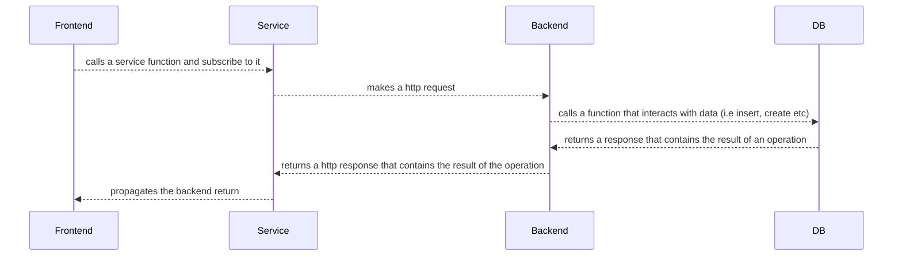

```mermaid
    sequenceDiagram
        Frontend-->>Service: calls a service function and subscribe to it
        Service-->>Backend: makes a http request
        Backend-->>DB: calls a function that interacts with data (i.e insert, create etc)
        DB-->>Backend: returns a response that contains the result of an operation
        Backend-->>Service: returns a http response that contains the result of the operation
        Service-->>Frontend: propagates the backend return 
```